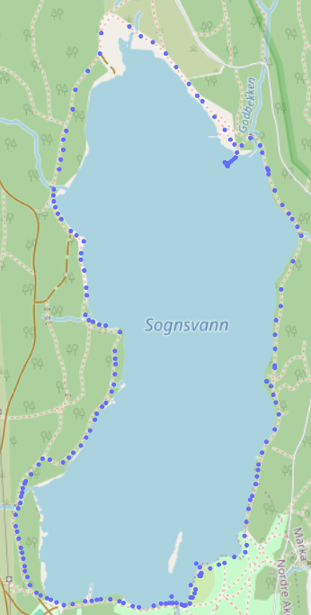

Friday 08/11-24, we performed a range test of our coming sensor buoy, and achieved a range of more than a kilometre. 
  <figure>
     
    <figcaption>Each blue dot is a single GPS measurement from the buoy. 
    </figcaption>
  </figure>