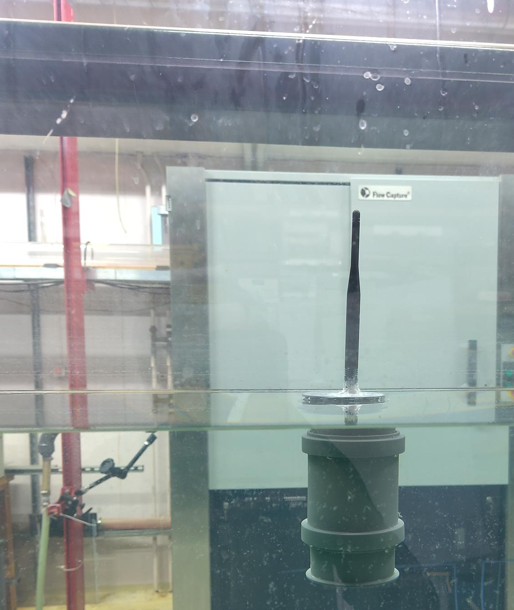
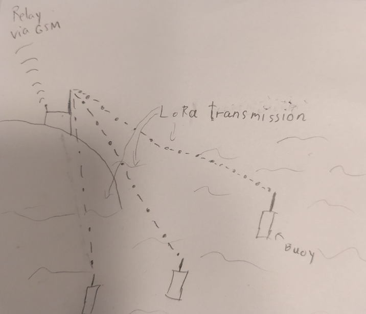

Sensor data have become an important tool in oceanographic science in recent years. Their low cost and relative ease of production have made them an invaluable tool in getting more information about the complex dynamical systems that govern the ocean. Recent additions include, but are not limited to  [microSWIFT](https://apl.uw.edu/project/projects/swift/pdfs/microSWIFTspecsheet.pdf), [OpenMetBuoy (OMB)](https://github.com/jerabaul29/OpenMetBuoy-v2021a) and [MELODI](https://ieeexplore.ieee.org/document/10641230). And while these sensors are great, the cost still lies at about 1000 USD due to the need for robust communication using technologies like Iridium and GSM. We aim to create a cheap and open source buoy to measure how the water flows in coastal environments such as a fjord. In these environments, we hope to be able to transmit the data using Long Range Wide Area Network (LoRaWAN) technology, which is both cheaper and less power hungry than the aforementioned GSM and Iridium technologies.

  <figure>
     
    <figcaption>Image from a water-proof test of the buoy. 
    </figcaption>
  </figure>

In our project, we aim to construct both an open source buoy design based around the [wio E5 mini](https://wiki.seeedstudio.com/LoRa_E5_mini/), and an open source base station equipped with both a LoRa receiver and a GSM module. Our aim is to be able to press the prie down enough that we can deploy a large quantity of these sensors in a coastal environment[^1] in order to get a detailed image of the flow and condition of the ocean in these areas. The data is for now intended to be used in the project [A Digital Twin of the Oslo fjord](https://ebjohnsen.org/project/oslofjord/), where we will use both sensor data and numerical simulations to create a better understanding of how the circulation and ocean conditions are affected by the human habitation in the area. 

  <figure>
     
    <figcaption> An illustration showing how the buoys are planned to transmit the data. This artwork is hand-drawn by the site owner. 
    </figcaption>
  </figure>

[^1]: Where the shorter range of LoRa compared to GSM/Irridium is possible to mitigate