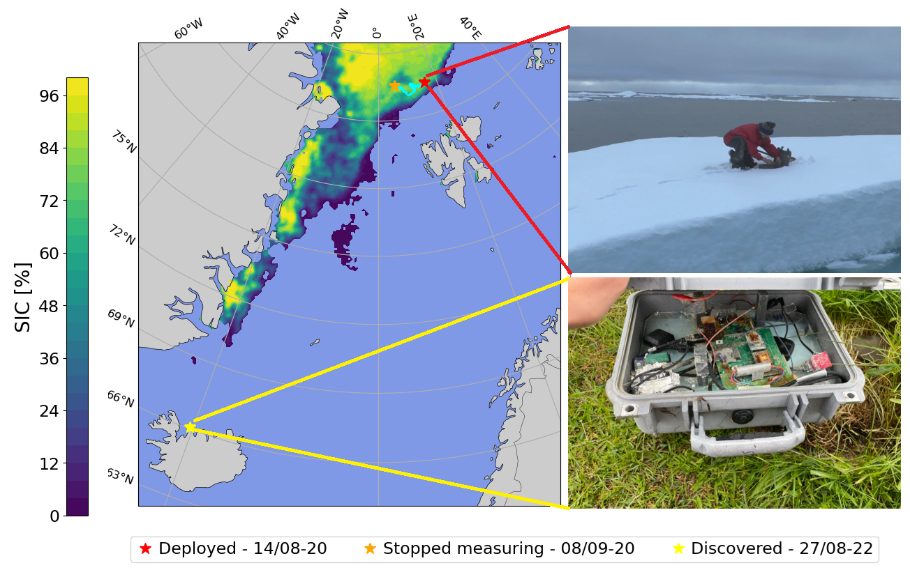

<h1>Direct in-situ observations of wave-induced floe collisions in the deeper Marginal Ice Zone <a class="headerlink" href="#Codes" title="Permalink to this headline">¶</a></h1>

The Arctic and Antarctic ice sheets are an important regulator of the global climate. For example, the 
  high albedo of the ice reflects sunlight, slowing global warming. However, these ice sheets are melting, 
  and the melting is accelerated by sea ice breaking. 

We have, in our new article  (see <a href="https://arxiv.org/abs/2404.02750">https://arxiv.org/abs/2404.02750</a>)
   found evidence suggesting that collisions between ice floes in the Marginal Ice Zone (Sea Ice concentration between 15%-80%) occur under normal weather conditions. 
   The existence of these collisions is important, as they take energy out of the incoming wave field,
   and accurate modelling of collisions in Arctic ocean models will hopefully yield
   better weather forecast models in the Arctic. 
   

  <figure>
     
    <figcaption>The deployed sensor travelled from the Yermak plateau north of Svalbard
      down to northern Iceland. The orange star show the spot where the drifter stopped working. 
    </figcaption>
  </figure>