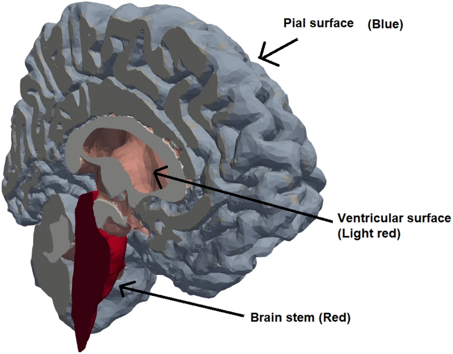

 Idiopathic Normal Pressure Hydrocephalus is a potentially reversible neurological disease characterized by enlarged ventricles, dementia and gait disturbance. As the name idiopathic suggest, the mechanisms that cause the illness are not known. To select patients for surgery, doctors often use an infusion test, in which the pressure of the cerebrospinal fluid (CSF) is measured before, during, and after a continous injection of artificial CSF has been injected into the central nervous system by means of a lumbar puncture. 

 Our article, which is published (link: <a href="https://fluidsbarrierscns.biomedcentral.com/articles/10.1186/s12987-024-00582-0">https://fluidsbarrierscns.biomedcentral.com/articles/10.1186/s12987-024-00582-0</a>) in *Fluids and Barriers of the CNS*, investigates what happens in the brain during an infusion test using numerical simulations in <a href="https://fenicsproject.org/">FEniCS</a>. Using brain geometries constructed from the MRI images from 33 healthy and 14 iNPH-diagnosed swedish patients as well as infusion test data measured from each, we were able to conclude (assuming the model fits) that the deformation of the brain itself from hydrocephalus did not affect the outcome of the infusion test. Furthermore, our simulation suggest that both factors from outside the brain (enforced in our model as boundary conditions) and changed material parameters (such as permeability) are plausible explanations for the difference in response to infusion. See an image of one of the brains below: 
   

  <figure>
     
    <figcaption>Brain geometry reconstruction from one of the simulation subjects. 
    </figcaption>
  </figure>